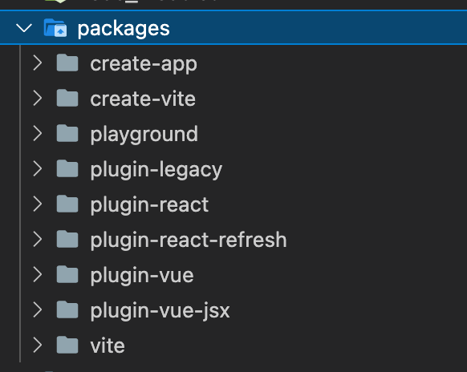

# Vue3 学习

> 课程相关源码在 tutor 文件夹内使用 node version >= 14 (stable)，yarn && yarn
> dev 或 npm i && npm run dev 启动此工程

## 启动一个基于 vite 的标准工程

`yarn create vite my-vite-app --template vue-ts`

## 一份简单的 tsconfig

```js
{
  "compilerOptions": {
    /**
     * esnext是vite推荐的默认值
     * 它告诉TS我们的工程将要使用TS支持的最高版本
     * 我们可以根据需求指定引用的es版本
     * 比如es6或es2015
     **/
    "target": "esnext",
    "useDefineForClassFields": true,
    /**
     * esnext是vite推荐的默认值
     * 指定ts文件编译后输出的结果为ES2020版本
     * 它会和我们在工程配置中使用到的import.meta相关
     **/
    "module": "esnext",
    "moduleResolution": "node",
    /**
     * 允许TS检查时开启所有严格模式限制
     * 更好得规范工程中的类型检查
     * 但是随着TS版本变动，涉及的规则会产生变化
     * 变更TS版本时要提前检查新的限制
     **/
    "strict": true,
    "jsx": "preserve",
    "sourceMap": true,
    "resolveJsonModule": true,
    "esModuleInterop": true,
    "lib": ["esnext", "dom"]
  },
  "include": [
    "src/**/*.ts",
    "src/**/*.d.ts",
    "src/**/*.tsx",
    "src/**/*.vue"
  ]
}

```

### 告诉 TS 我们的路径

> 需要在 vite 的 config 里面同样配置一份

```js
{
  + "paths": {
      "@/*": ["./src/*"],
      "@C/*": ["./src/components/*"],
      "hooks/*": ["./src/hooks/*"]
    }
}
```

## bundle

> 顾名思义，就是打包

### Why bundle

- 体积更小（Tree-shaking、压缩、合并），加载更快；
- 能编译高级语言或者语法（TS、ES6+、模块化、scss 等）；
- 兼容性和错误检查（Polyfill、postcss、eslint）；

## no-bundle

> 顾名思义，就是“不要”打包

### Why no-bundle

- 非现代浏览器不支持 ESM，开发时也必须打包。打包时一个文件的依赖要打包，文件的依
  赖的依赖也要打包，这是一个**O(n)**。每次 HMR 时间（webpack4）在低性能机子上往
  往要 10s 起步，影响开发效率；
- 现代浏览器已经支持 ESM，我们开发的时候可以让浏览器帮我们解析 ESM 文件内容，那
  么打包时也只要**按需打包，打包文件的时间复杂度降到 O(1)**，将开发者从长时间等
  待中解放；

### 真的不要打包？

- 拥有预打包流程。项目启动前，会根据 vite 的插件设置对部分常用依赖直接打包，进行
  缓存。再根据入口文件引用顺序，以此加载缓存文件或进行依赖打包；

### vite cli


