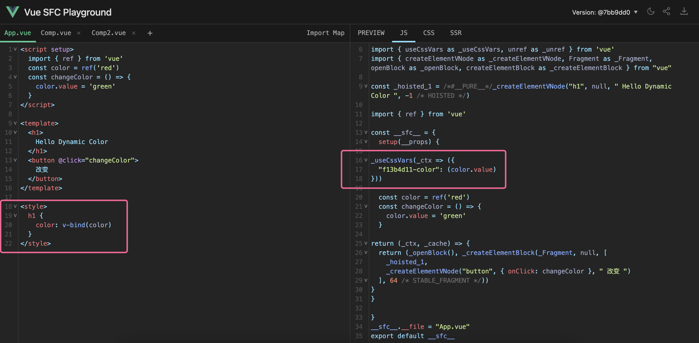

# 共性和区别

1.  两者都可以监听到 data 的变化；
2.  watch 需要明确监听属性；
3.  watchEffect 会根据其中的属性，自动监听其变化。

## watch

- watch 函数要求至少传入(响应式对象或函数 , 回调函数 )，第三个入参是一个配置对象
  - 如果第一个参数传入函数，会自动包装成为响应式对象，并且收集里面需要监听的对象
    属性。如果要监听一个 reactive 对象中的部分属性，可以采用这个办法；
  - 配置对象
    - immediate，初始化的时候是否执行监听，默认为 false；
    - deep，是否采用深度监听，是否深度监听；
    - flush
      - pre，默认，数据更新时就触发
      - post，组件更新后触发，可以保证拿到更新后的 dom
      - sync，强制同步触发

## watchEffect

- watchEffect 函数要求传入至少一个回调函数 ，第三个入参与 watch 的 flush 相同
  - 它在初始化的时候一定会触发一次（它要收集需要监听的数据），相当于 watch 指定
    了 immediate: true ；
  - 它可以自动收集函数作用域内的响应式对象，并且在它们改变的时候再次执行调用；

## style 动态引入

