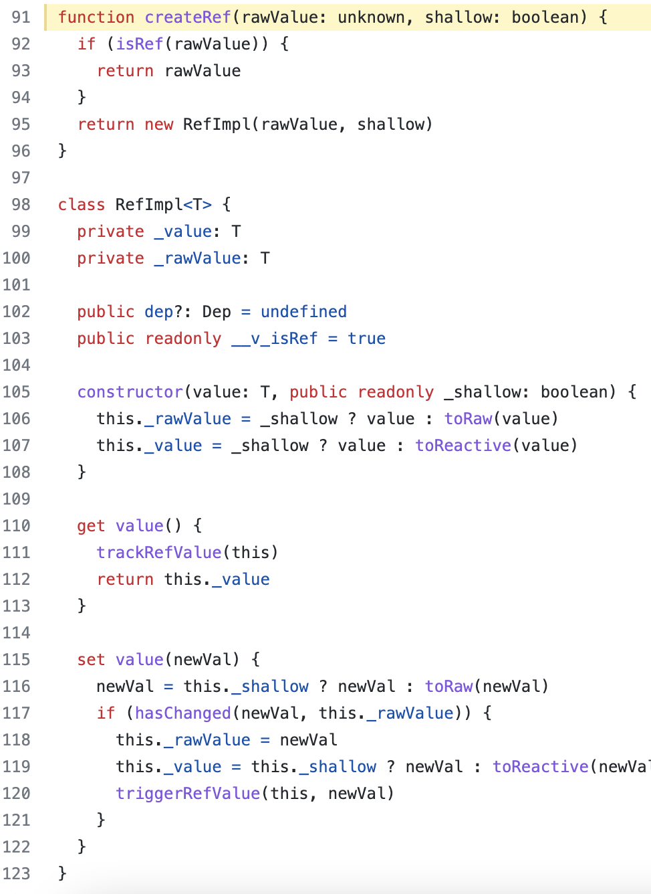
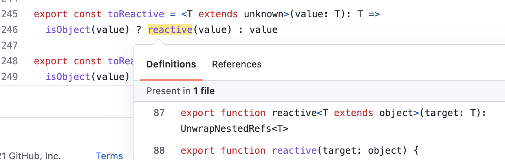
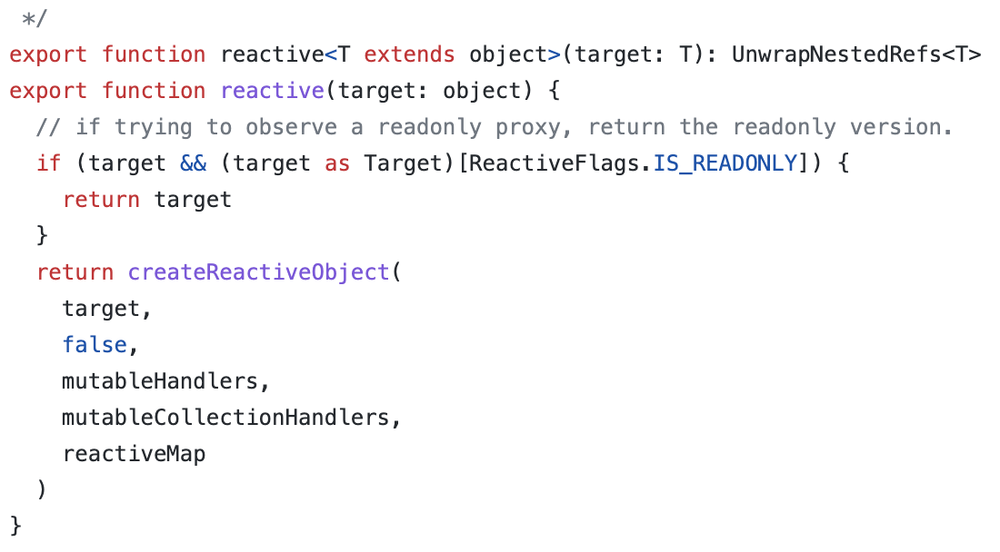

# 3 个 ref

## ref

- 生成值类型的响应式数据
- 可用于模板和 reactive
- 通过`.value`修改值

## ref 是怎么来的？

- 通过 console 打印，我们知道 reactive 是一个 Proxy，而 ref 的.value 也是一个
  proxy
  - 猜测，ref 的 value 其实就是 reactive

### 验证

### ref 的构造方法

### value 指向 toReactive

### toReactive 实质调用 reactive 方法

## toRef

- 针对一个响应式对象（reactive）的 prop
  - 如果用在普通对象上，则没有响应式效果（本来也没有这个必要）
- 创建一个 ref，具有响应式
- 两者保持引用关系

## toRefs

- 将一个响应式对象（reactive）转换为普通对象
- 对象的每个 prop 都是对应的 ref
- 两者保持引用关系

## 推荐使用

- 合成函数返回响应式对象时，使用 toRefs，有利于使用方进行结构
- 用 reactive 做对象的响应式，用 ref 做值类型响应式
- setup 中返回 toRefs(state)，或者 toRef(state, 'xxx')
- ref 的变量命名带上 Ref，例如 xxxRef

## 为什么需要 ref

- 返回值类型，会丢失响应式
  - 例如我声明一个 let a = 20 那么我的修改不会反映到模板上；
  - 但为什么有了 reactive 还是加入了 ref 概念？
    - 在 setup、computed、合成函数，都有可能返回值类型
  - 如果不定义 ref，用户也将会制造一个 ref 概念

## 为什么需要.value

- ref 是一个响应式对象，.value 存储值
- 通过.value 实现 get 和 set 实现响应式
- 用于模板和 reactive 的时候，不需要.value（vue 的运行时可以控制），其他情况都需
  要

## 为什么需要 toRef 和 toRefs

- 初衷：不丢失响应式的情况下，把对象数据 分解/扩散（解构）
- 前提：针对的是响应式对象（reactive 封装的）非普通对象
- 更好地延续响应式（ref 创造响应式）
